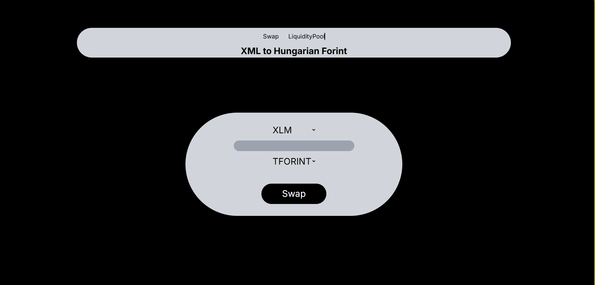
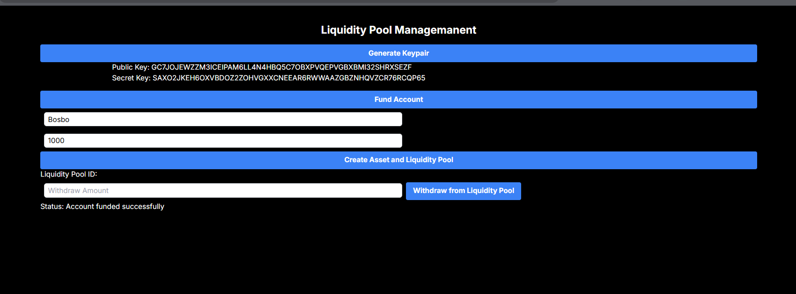

##   Asset Exchange via Liquidity Pool 

##   Purpose  to swap to token based on liquidity pool created for both assets

##   How to use
 * clone the repository 
*   Run `yarn install`
*  Run `yarn dev`
*  Visit http://localhost:3000
*  Use the liquidity pool page to create liquidity pool for XLM and TFORINT

6. - Use the swap page to swap between XLM and TFORINT

